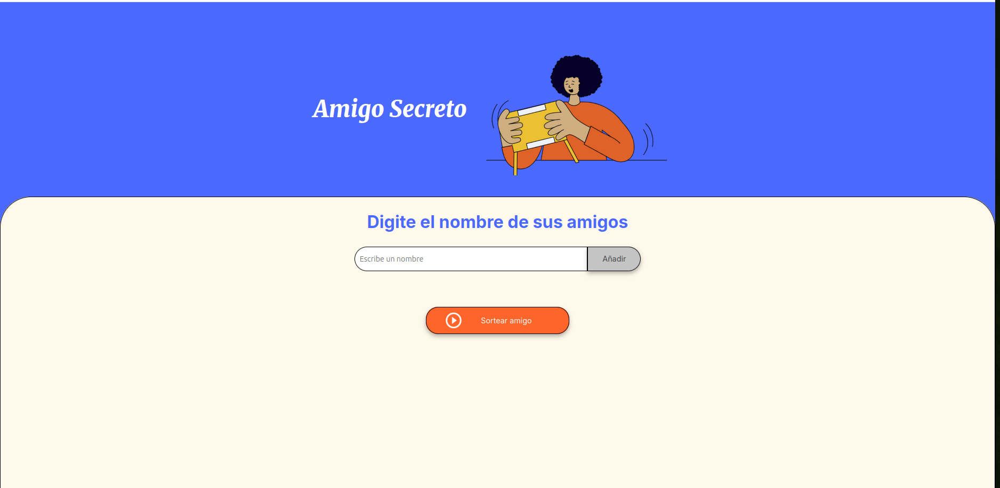

# 🎁 Amigo Secreto

Este proyecto es una pequeña aplicación web que permite simular un sorteo de "Amigo Secreto" entre un grupo de personas. Los usuarios pueden agregar nombres a una lista y, al finalizar, se seleccionará aleatoriamente un nombre como el amigo secreto.

---

## Funcionalidades

✅ Agregar nombres a la lista  
✅ Validar que el campo de entrada no esté vacío  
✅ Visualizar en pantalla la lista completa de amigos añadidos  
✅ Sortear aleatoriamente un nombre y mostrar el resultado  

---

## Vista previa

---

## Cómo ejecutar el proyecto

Sigue estos pasos para ejecutar la aplicación en tu equipo local: